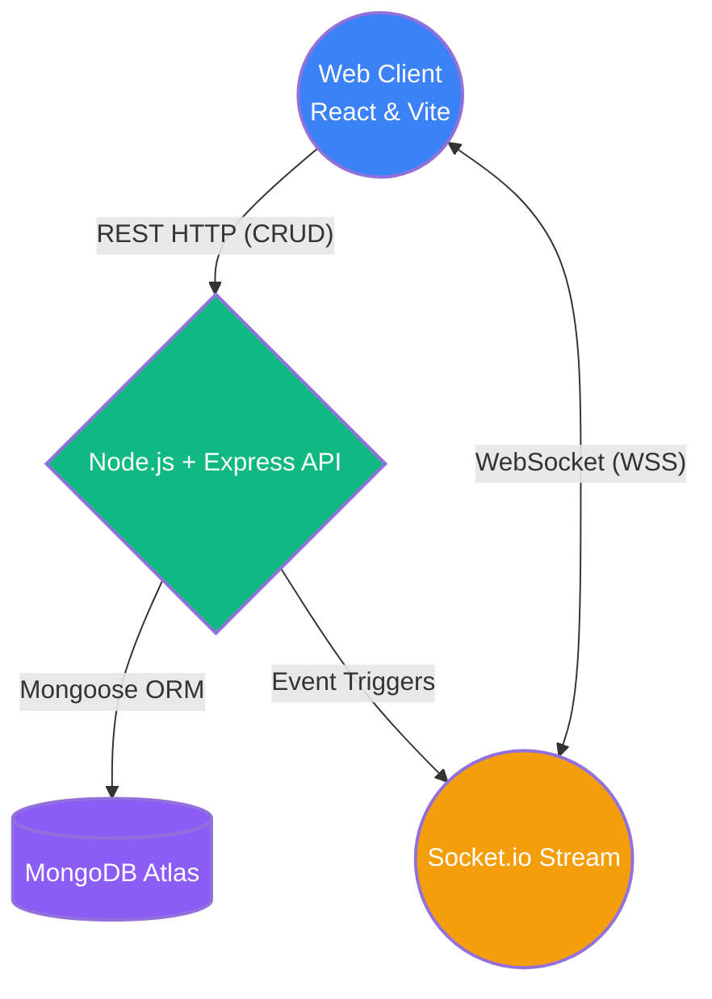

# British Auction Procurement Platform

A high-performance real-time Request For Quotation (RFQ) and dynamic auctioning platform explicitly engineered for Freight and Logistics bidding. The platform enables **Buyers** to generate active commodity shipping requests while allowing multiple **Suppliers** to compete against each other in real-time blind and open auction environments. 

## 🏗️ High-Level Design (HLD)

The system operates across a dual-tier Fullstack architecture anchored by a bidirectional WebSocket communication layer for millisecond-level synchronization.



### Core Architecture Subsystems
1. **Frontend**: Vite-compiled React Application executing dynamic component renders. Styled with curated Vanilla CSS and smooth `framer-motion` layout animations. Modals natively handle user warnings, backed by `react-toastify` for absolute non-blocking WebSocket visual popups.
2. **Backend**: Express container governing absolute schema logic, JWT validation, and heavy mathematical time-extension polling. Secure API Endpoints intercept legacy structural updates through strict `protect` middleware logic.
3. **Database Layer**: MongoDB cluster utilizing strict Mongoose typing, schema validation, and populated object references.
4. **Real-time Pipeline**: Event-driven Socket.io state machine perfectly orchestrating live updates across decoupled React interfaces, mitigating standard polling drag.

---

## 🗄️ Database Schema Design

The entire platform pivots on normalized strict relations utilizing `ObjectId` arrays for highly scalable relationships.

### `User` Collection (Authentication)
Governs both active market roles interacting with the auctions.
- `name` (String, required)
- `email` (String, unique, required)
- `password` (String, bcrypt hashed)
- `role` (Enum strictly limited to `['BUYER', 'SUPPLIER']`)
- `createdAt` / `updatedAt` (Timestamps)

### `Rfq` Collection (Auctions)
The central nervous system of the shipment parameters.
- `rfqId` (String, unique generator label)
- `name` (String, auction title)
- `status` (Enum: `['Active', 'Closed', 'Force Closed']`)
- `buyerId` (ObjectId ref User, Procurement owner)
- `awardedBidId` (ObjectId ref Bid, Nullable until conclusion)
- `currentBidCloseDate` (Date, dynamic shifting timer)
- `initialBidCloseDate` (Date, standard baseline expiration)
- `forcedBidCloseDate` (Date, absolute Hard Stop timer limit)
- `triggerWindowMinutes` (Number, live extension activation threshold)
- `extensionDurationMinutes` (Number, exact duration mathematical bump)
- `startLocation` & `destinationLocation` (Embedded Objects for address arrays)
- `consignmentDetails` (Embedded Object tracking: weight, dimensions, hazmat rules, commodity name)

### `Bid` Collection (Quotations)
The competitive layer directly mapping Suppliers to RFQs.
- `rfqId` (ObjectId ref Rfq)
- `supplierId` (ObjectId ref User)
- `supplierName` (String, cached label)
- `carrierName` / `transitTime` / `validity` (Strings for logistics evaluation)
- `freightCharges` / `originCharges` / `destinationCharges` (Numbers, independent billing blocks)
- `totalAmount` (Number, math aggregate for sorting algorithms)
- `rank` (String, `L1, L2, L3...` dynamic ladder generated on every request)

### `ActivityLog` Collection (Events)
The non-mutable ledger explicitly logging system mutations for transparent data tracking.
- `rfqId` (ObjectId ref Rfq)
- `type` (Enum: `['NEW_BID', 'STATUS_CHANGE', 'TIME_EXTENSION']`)
- `message` (String, frontend visual representation)
- `createdAt` (Timestamp)

---

## 🚀 Execution & Deployment

### Local Development
```bash
# Terminal 1: Initialize Backend Node Server
cd backend
npm install
npm run dev

# Terminal 2: Initialize Frontend React Application
cd frontend
npm install
npm run dev
```

### Production Deployment Strategy
1. **Frontend**: Vite bundle compiled and dynamically deployed statically to **Vercel** (`vercel --prod`).
2. **Backend**: Express node process deployed to standard Linux compute clusters (Render, Heroku, AWS Elastic Beanstalk). Environment Variables require `MONGO_URI` injection.
