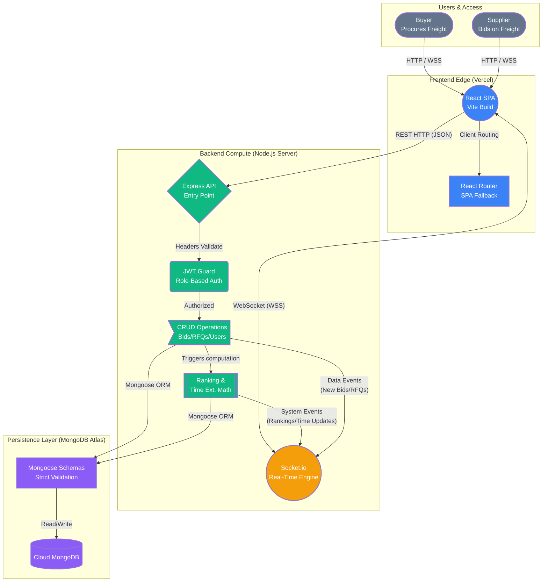
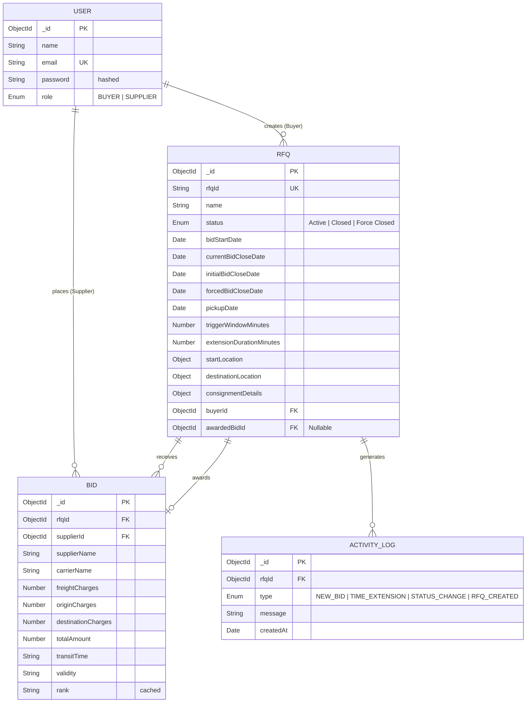
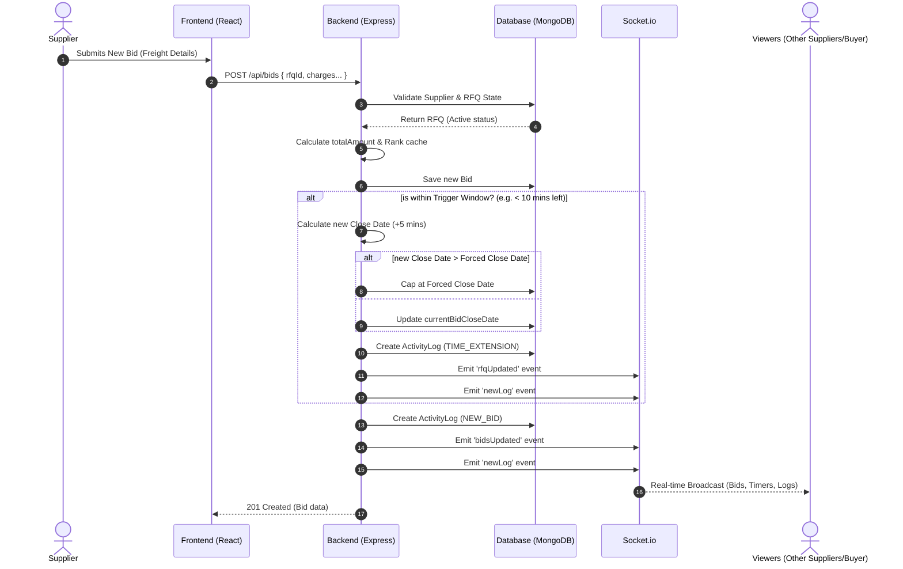

# British Auction Procurement Platform

A high-performance real-time Request For Quotation (RFQ) and dynamic auctioning platform explicitly engineered for Freight and Logistics bidding. The platform enables **Buyers** to generate active commodity shipping requests while allowing multiple **Suppliers** to compete against each other in real-time blind and open auction environments. 

## 🏗️ High-Level Design (HLD)

The system operates across a dual-tier Fullstack architecture anchored by a bidirectional WebSocket communication layer for millisecond-level synchronization.

### System Architecture Diagram



### Architectural Layers & Subsystems

#### 1. Presentation Layer (Vite + React)
The client-side interface is an immensely responsive Single Page Application (SPA).
- **State Management:** Utilizes React's native Context API and hook-driven local state to manage complex auction forms, decoupled from backend latency.
- **Routing & Fallbacks:** Driven by `react-router-dom`. In production, Vercel Edge rules transparently redirect deep links back to `index.html` to prevent 404s.
- **UI & Animations:** Employs `framer-motion` for fluid modal popups and layout transitions. Real-time system notifications are cleanly handled non-intrusively via `react-toastify`.

#### 2. API & Business Logic Layer (Node.js + Express)
The synchronous backbone handling strict data validation and RESTful operations.
- **Routing Controllers:** Segregated logic paths (`auth.js`, `bid.js`, `rfq.js`) ensuring single-responsibility handlers.
- **Computation Engine:** Calculates bid rankings, dynamically extends auction deadlines based on temporal thresholds (`triggerWindowMinutes`), and processes financial freight aggregations on the fly.
- **Error Handling:** Centralized Express middleware intercepts MongoDB validation failures and structural syntax errors, normalizing them into readable HTTP responses.

#### 3. Real-Time Event Layer (Socket.io)
The asynchronous pipeline completely eliminating standard HTTP polling drag.
- **Bidirectional Duplex:** Maintains persistent TCP connections with active users.
- **Event Broadcasting:** Instantly emits payload triggers like `newRfq`, `bidsUpdated`, and `newLog` the exact millisecond a database transaction commits, ensuring all observing suppliers and buyers see identical synchronized states.

#### 4. Data Persistence Layer (MongoDB + Mongoose)
A flexible but rigidly validated document-store architecture.
- **Relational Integrity:** Implements normalized relationships using arrays of `ObjectId`s (e.g., embedding User IDs inside RFQs and Bids) mapping to strict Mongoose Schemas.
- **Middleware Hooks:** Uses pre-save hooks (like `bcrypt.genSalt` for passwords) ensuring data mutations are sanitized *before* storage mapping.

#### 5. Security & Authentication Layer
- **Stateless Sessions (JWT):** All API payload requests are guarded by custom `protect` middleware that intercepts, decodes, and validates Bearer tokens on the Authorization header.
- **Role-Based Access Control (RBAC):** API endpoints dynamically verify if the requesting Token belongs to a `BUYER` or a `SUPPLIER`, practically rejecting unauthorized mutations (e.g., a Buyer cannot place a Bid, a Supplier cannot create an RFQ).

---

## 🗄️ Database Schema Design (ER Diagram)

The entire platform pivots on normalized strict relations utilizing `ObjectId` arrays for highly scalable relationships.



---

## 🔄 System Workflows & UML Sequence Diagrams

### 1. Dynamic Bidding & Time Extension Workflow

A fundamental mechanic of the British Auction system is dynamic time extensions. If a bid is placed near the closing time (within the `triggerWindowMinutes`), the auction deadline is automatically extended (by `extensionDurationMinutes`), ensuring suppliers always have a fair chance to counter-bid up until the absolute `forcedBidCloseDate`.



---

## 🚀 Execution & Deployment

### Local Development
```bash
# Terminal 1: Initialize Backend Node Server
cd backend
npm install
npm run dev

# Terminal 2: Initialize Frontend React Application
cd frontend
npm install
npm run dev
```

### Production Deployment Strategy
1. **Frontend**: Vite bundle compiled and dynamically deployed statically to **Vercel** (`vercel --prod`).
2. **Backend**: Express node process deployed to standard Linux compute clusters (Render, Heroku, AWS Elastic Beanstalk). Environment Variables require `MONGO_URI` injection.
