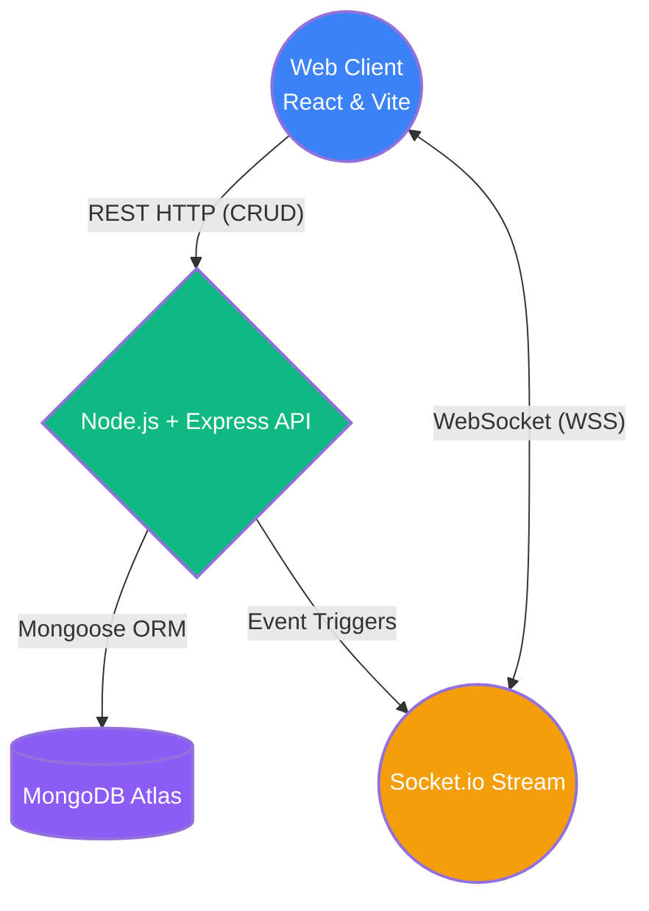
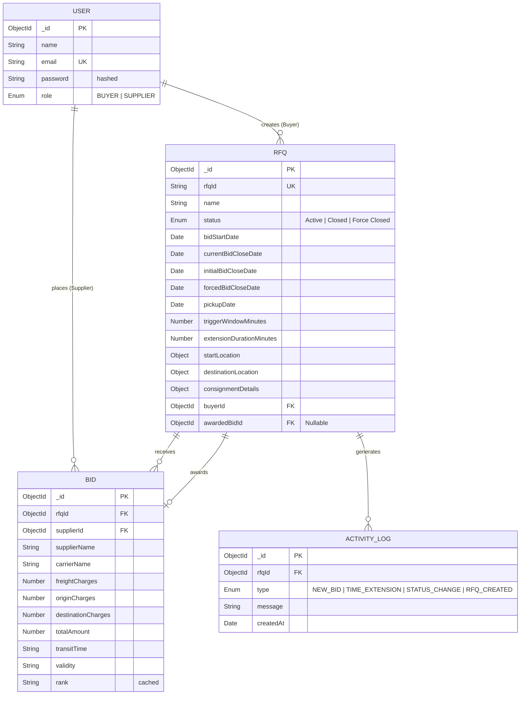
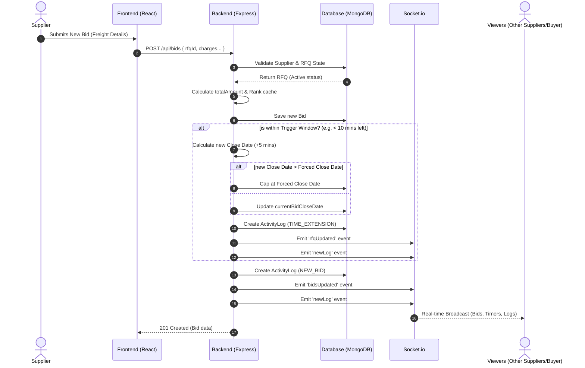

# British Auction Procurement Platform

A high-performance real-time Request For Quotation (RFQ) and dynamic auctioning platform explicitly engineered for Freight and Logistics bidding. The platform enables **Buyers** to generate active commodity shipping requests while allowing multiple **Suppliers** to compete against each other in real-time blind and open auction environments. 

## 🏗️ High-Level Design (HLD)

The system operates across a dual-tier Fullstack architecture anchored by a bidirectional WebSocket communication layer for millisecond-level synchronization.

### System Architecture Diagram



### Core Architecture Subsystems
1. **Frontend**: Vite-compiled React Application executing dynamic component renders. Styled with curated Vanilla CSS and smooth `framer-motion` layout animations. Modals natively handle user warnings, backed by `react-toastify` for absolute non-blocking WebSocket visual popups.
2. **Backend**: Express container governing absolute schema logic, JWT validation, and heavy mathematical time-extension polling. Secure API Endpoints intercept structural updates through strict `protect` middleware logic.
3. **Database Layer**: MongoDB cluster utilizing strict Mongoose typing, schema validation, and populated object references.
4. **Real-time Pipeline**: Event-driven Socket.io state machine perfectly orchestrating live updates across decoupled React interfaces, mitigating standard HTTP polling drag.

---

## 🗄️ Database Schema Design (ER Diagram)

The entire platform pivots on normalized strict relations utilizing `ObjectId` arrays for highly scalable relationships.



---

## 🔄 System Workflows & UML Sequence Diagrams

### 1. Dynamic Bidding & Time Extension Workflow

A fundamental mechanic of the British Auction system is dynamic time extensions. If a bid is placed near the closing time (within the `triggerWindowMinutes`), the auction deadline is automatically extended (by `extensionDurationMinutes`), ensuring suppliers always have a fair chance to counter-bid up until the absolute `forcedBidCloseDate`.



---

## 🚀 Execution & Deployment

### Local Development
```bash
# Terminal 1: Initialize Backend Node Server
cd backend
npm install
npm run dev

# Terminal 2: Initialize Frontend React Application
cd frontend
npm install
npm run dev
```

### Production Deployment Strategy
1. **Frontend**: Vite bundle compiled and dynamically deployed statically to **Vercel** (`vercel --prod`).
2. **Backend**: Express node process deployed to standard Linux compute clusters (Render, Heroku, AWS Elastic Beanstalk). Environment Variables require `MONGO_URI` injection.
